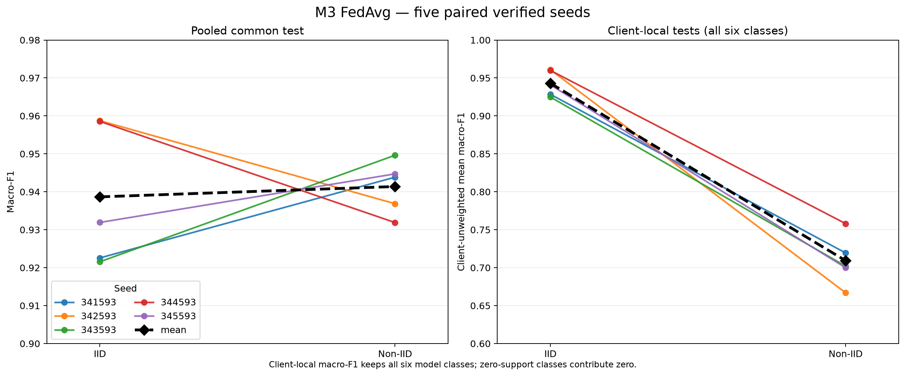

# M3 paired multi-seed FedAvg result

This sanitized snapshot contains the independently verified summary of five paired IID and
non-IID FedAvg runs. The M2 split, model architecture, optimizer, participation policy, and
validation-only checkpoint rule are fixed; the partitioning and training seed changes in each
pair. The ten source workspaces are not published because they contain model and client-update
objects.

Verification recomputed every source partition, FedAvg run, metric file, client-local comparison,
and aggregate statistic. The summary manifest SHA-256 is
`430d02c6a0750f6bb64e6f5b21f57911fd616aae1a4f6001c0b70d6615cf03f7`.

## Primary results

| Metric | IID mean | IID 95% CI | Non-IID mean | Non-IID 95% CI |
|---|---:|---:|---:|---:|
| Pooled test macro-F1 | `0.9387` | `[0.9155, 0.9619]` | `0.9414` | `[0.9327, 0.9501]` |
| Pooled test accuracy | `0.9705` | `[0.9607, 0.9802]` | `0.9549` | `[0.9500, 0.9597]` |
| Temporal benign false-alarm rate | `0.0036` | `[0.0029, 0.0042]` | `0.0115` | `[0.0052, 0.0178]` |
| FedAvg client-local macro-F1 mean | `0.9430` | `[0.9219, 0.9640]` | `0.7093` | `[0.6680, 0.7506]` |
| Local-only client-local macro-F1 mean | `0.9094` | `[0.9023, 0.9164]` | `0.6523` | `[0.6279, 0.6767]` |
| FedAvg minus local-only client-local mean | `+0.0336` | `[+0.0118, +0.0554]` | `+0.0570` | `[+0.0166, +0.0975]` |

The paired non-IID-minus-IID pooled test macro-F1 difference is `+0.0027`, with a 95% interval
of `[-0.0287, +0.0341]`. The interval includes zero, so these five runs do not establish a
pooled macro-F1 advantage for either partition mode.

The paired client-local all-class difference is `-0.2337`, with a 95% interval of
`[-0.2794, -0.1880]`. This score deliberately keeps all six model classes: a class absent from
a client's test contributes zero. It therefore captures both predictive performance and local
class coverage and must not be interpreted as a pure classifier-performance loss. The pooled
common test remains the primary IID/non-IID comparison.

FedAvg exceeds the local-only baseline on the same local-test protocol in both modes. Non-IID
also raises the benign-only temporal false-alarm rate and reduces reconnaissance and
multi-tactic F1, even though pooled macro-F1 remains similar.

## Files

- `summary.json`: per-run values, per-class metrics, mode summaries, paired differences, and
  source digests;
- `runs.csv`: compact ten-run table;
- `manifest.json`: SHA-256 bindings for `summary.json`, `runs.csv`, the fixed M2 manifest, and
  every verified source workspace;
- `paired-iid-non-iid.png`: visualization derived from the copied summary.

The snapshot contains no dataset rows, model weights, client updates, certificates, TPM state,
or private keys.
