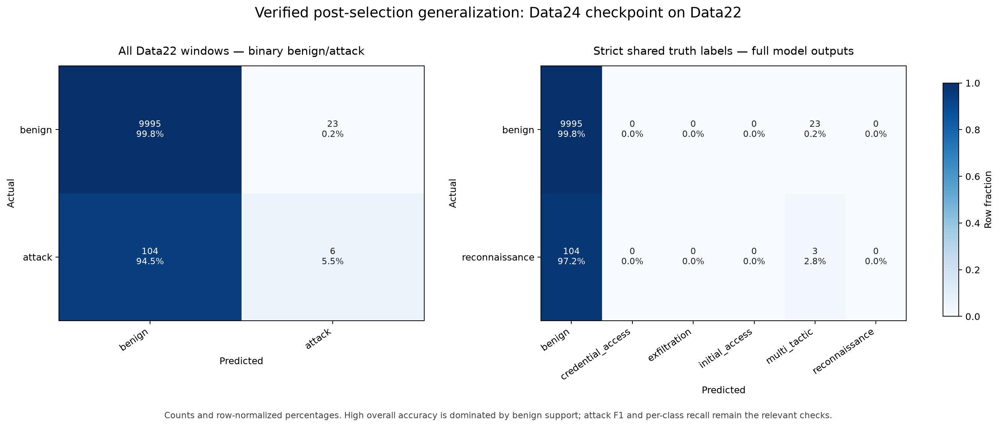
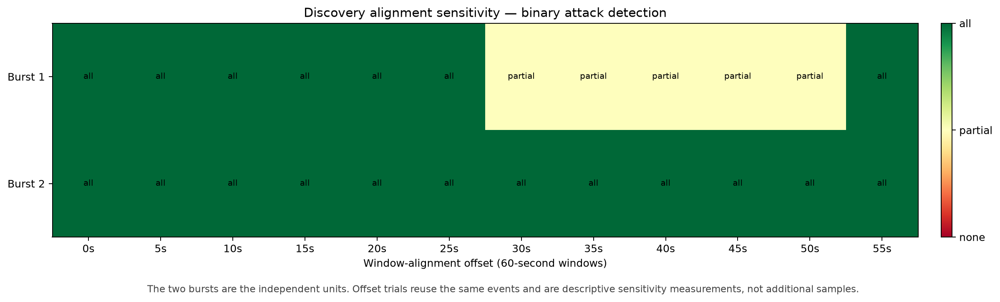

# Verified M5 external generalization on UWF-ZeekData22

This sanitized snapshot reports a post-selection test of the frozen round-11
checkpoint from the verified M4/M5 reference campaign. Data22 was not used for training,
validation, checkpoint selection, hyperparameter selection, or threshold selection.

## Main result

The official five-file CSV subset produced 10,128 60-second
windows: 10,018 benign,
107 reconnaissance, and
3 Discovery windows.

| Scope | Result |
|---|---:|
| Binary attack precision | `0.2069` |
| Binary attack recall | `0.0545` |
| Binary attack F1 | `0.0863` |
| Binary balanced accuracy | `0.5261` |
| Benign specificity | `0.9977` |
| Shared-label macro-F1 | `0.4968` |
| Reconnaissance recall | `0.0000` |
| Rows with any scaled feature beyond ±5 | `0.9997` |

Overall accuracy is 0.9875, but it is dominated by the 9,995
correct benign windows. The selected checkpoint recognizes only 6
of 110 attack windows after benign/attack collapse and
never predicts `reconnaissance`. This is a verified cross-domain generalization failure, not a
pipeline error. The feature-shift result shows that nearly every external row lies far outside
the Data24 training distribution under the frozen train-only scaler.

## Discovery alignment sensitivity

The three primary Discovery windows represent only two independent temporal bursts. A separate
stress test retains the trained 60-second window duration and shifts its alignment through
12 offsets from 0 to 55 seconds. It uses 2,086 controlled
Discovery events and creates 32 target-containing windows.

| Discovery scope | Detection result |
|---|---:|
| Burst × alignment trials (correlated) | `24` |
| At least one segment detected as attack | `24/24` (`1.0000`) |
| Every segment detected as attack | `19/24` (`0.7917`) |
| Burst 1: every segment detected | `7/12` |
| Burst 2: every segment detected | `12/12` |

Every alignment detects at least one segment from each burst as non-benign. Burst 1 spans a
minute boundary and, for five offsets, is split so that one segment is predicted `benign` and
one `multi_tactic`. Burst 2 remains `multi_tactic` at every offset. Offset zero reproduces the
three primary Discovery predictions byte for byte.

This is not an estimate of Discovery recall over 24 independent observations. Only two bursts
are independent; offsets reuse the same events. Discovery is outside the fixed six-class model
head, so this stress test supports only the binary statement “some part of the burst was flagged
as attack.” It does not demonstrate open-set Discovery classification, calibrated confidence,
or population-level performance.

## Provenance and published files

- external evaluation: `m5-external-generalization-8ba28d267facbc1f91af7948`;
- Discovery stress: `m5-discovery-stress-d4a3898efbb5682c01d4ffa2`;
- selected model SHA-256: `007e3fafd35f292eb72cc4c42c1f05b51210f90637af7da9b345d1e45a123e6e`;
- published metrics SHA-256: `d66bc81ed702c1b8a10289fed28c8cf775cf174703f2837710a03dc6ab3c2b38`;
- the receipt separately binds the complete primary, stress, and external source manifests;
- zero-offset primary reproduction: `true`.

`metrics.json` and `discovery-stress.json` are copied byte-for-byte from verified workspaces.
`discovery-trials.csv` is a compact derived table. The two figures visualize the published
metrics, and `receipt.json` records verification and source hashes. `manifest.json` binds all
published payloads.

Raw Data22 records, per-window predictions, Data24 data, client updates, trust material, and
model checkpoints remain in Git-ignored controlled storage and are deliberately not published.
