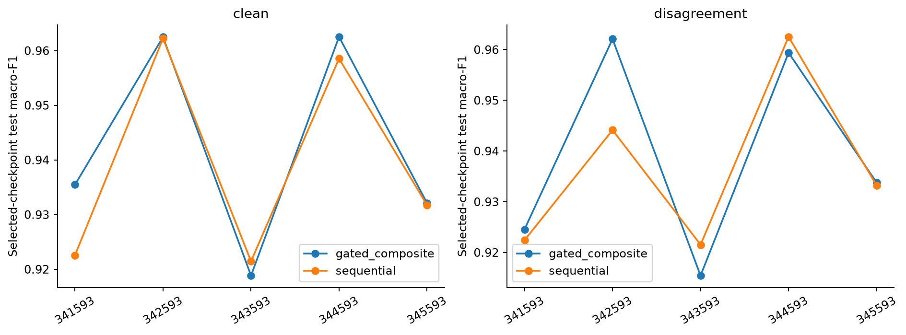
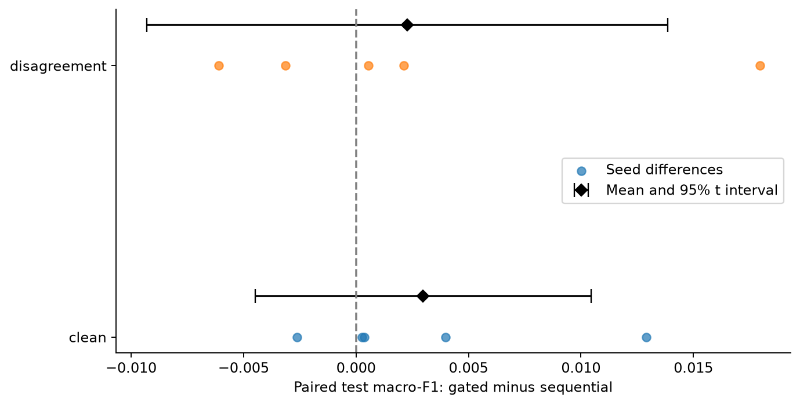
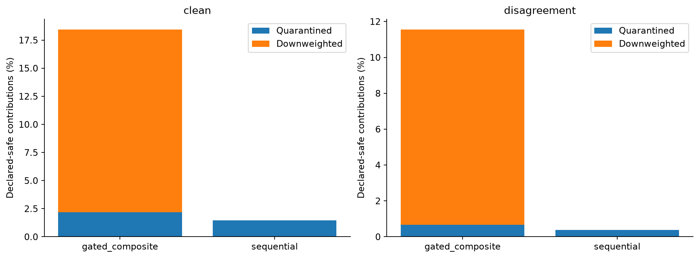
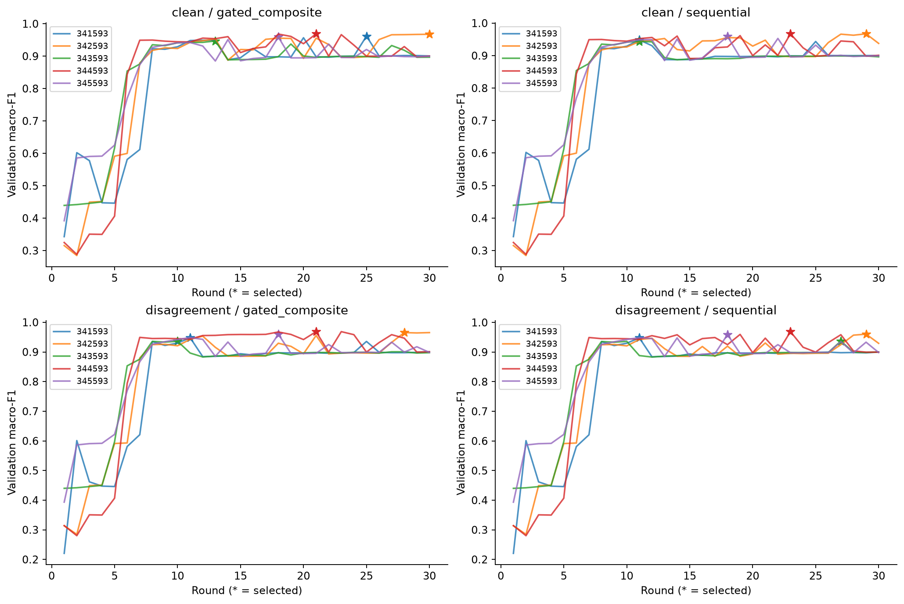

# M6 active-policy comparison: five paired seeds

Completed 2026-09-25: 20 campaigns, 600 rounds and 9,000 contribution decisions.
Each campaign's M5 verifier completed successfully. The report additionally checked
final-evaluation hashes, all checkpoint/validation hashes, decision bindings, CPU seeds,
and common partitions within each seed. It does not replace the cryptographic verifier.

## Protocol

Seeds: 341593, 342593, 343593, 344593, 345593. Each seed has independent clean and
controlled-disagreement trajectories for gated_composite and sequential, with the same
IID partition and initialization seed. Training uses CPU, 30 rounds, four workers and
attestation refresh every three rounds. The M2 split, calibration, thresholds and attack
assignments stay fixed. Validation selects the checkpoint; its test result is then evaluated.
The original four pilot campaigns contribute seed 341593, without rerunning or selecting
among alternative results. Tiny cross-run floating-point variation was seen during smoke;
bitwise identical trajectories are not assumed.

## Predictive performance

| Condition | Gated mean ± sample SD | Sequential mean ± sample SD | Paired difference | 95% t interval of difference |
|---|---:|---:|---:|---:|
| Clean | 0.942285 ± 0.019478 | 0.939303 ± 0.019694 | +0.002982 | [-0.004490, +0.010455] |
| Disagreement | 0.939053 ± 0.020853 | 0.936771 ± 0.017085 | +0.002281 | [-0.009307, +0.013869] |

The difference is gated minus sequential, paired by seed. Positive values favor gated.
The clean mean advantage is 0.298 percentage points and the attacked advantage 0.228.
Both intervals include zero: these data do not establish superior predictive performance.
They also do not establish equivalence. Gated wins in four of five clean pairs and three
of five attacked pairs. Seed 342593 contributes the largest attacked gain (+0.017960),
while seeds 343593 and 344593 favor sequential under attack.

Lines connect seed results to aid comparison, not to imply seed is a continuous variable.
Each point is a validation-selected model evaluated on the common held-out test split.

Dots show the five paired differences. Diamonds show their mean; bars use Student-t
with four degrees of freedom and sample standard deviation divided by sqrt(5).
The independent repetition unit is the seed, not rounds or contributions. Intervals are
approximate, unadjusted descriptive intervals for this fixed dataset/protocol; with only
five pairs their distributional assumptions are difficult to assess. The test observations
are reused across seeds, so this is not a population or external-dataset generalization bound.

## Admission and cost on benign contributions

| Condition | Policy | Safe contributions | Safe quarantined | Safe downweighted | Unsafe quarantined / total |
|---|---|---:|---:|---:|---:|
| Clean | gated_composite | 2250 | 49 (2.18%) | 366 (16.27%) | N/A |
| Clean | sequential | 2250 | 33 (1.47%) | 0 | N/A |
| Disagreement | gated_composite | 1800 | 12 (0.67%) | 196 (10.89%) | 450/450 |
| Disagreement | sequential | 1800 | 7 (0.39%) | 0 | 450/450 |

Bars separate full exclusion from retention at half weight. Counts are pooled descriptive
counts, not independent Bernoulli trials. Gated intervenes on 18.44% of safe clean
contributions versus 1.47% for sequential; under disagreement these are 11.56% and 0.39%.
A downweight is not equivalent to a quarantine and neither proves malicious intent.
The compared policies induce different later models and updates: the table is a policy
trajectory comparison, not a causal intervention on identical update bytes each round.

No declared-unsafe contribution is retained by either policy. Of 450 unsafe observations
per policy, 300 are configured counterfactual trust-failure cells and 150 are trusted but
statistically attacked cells. Signed sign-flipped/amplified updates are real runtime
submissions, but the failed-trust inputs are controlled counterfactuals, not genuine failed
Quotes. These results cannot establish robustness to adaptive or arbitrary attacks.

## Training and checkpoint selection

Each line follows one seed's validation macro-F1 across 30 rounds. Stars mark the selected
checkpoint; selection is based on validation, not the displayed test comparisons. Curves
show substantial later-round variation, explaining why final-round and selected-checkpoint
scores should not be conflated. Exact selected rounds and scores appear in runs.csv;
round-level plotting data are in rounds.csv.

## Interpretation and next work

Keeping gated_composite as the reference is a declared design choice, not an empirical
claim of universal superiority. The current five-seed evidence supports equal observed
unsafe rejection in this scenario, a small uncertain mean predictive gain, and a clearly
larger intervention cost on benign contributions. Sequential is a competitive simpler
ablation. Threshold/weight sensitivity and a separately defined adaptive attack are useful
next experiments; these test results must not be used to retune the current contract.
Real Quote-failure replication, external data and other partition regimes remain distinct.

## Artifacts and reproduction

- summary.json: means, SDs, paired intervals and source manifest/evaluation hashes.
- runs.csv: all 20 campaign rows, selection and admission counts.
- rounds.csv: all 600 validation observations.
- Four figures in PNG and PDF; each figure was visually inspected.
- report-manifest.json: SHA-256 inventory of report files and generation script.

Run `python scripts/report_m6_policy_multiseed.py` from the repository root with verified
local campaign workspaces and execution logs available. The script refuses an existing
output directory; preserve the published report before choosing a new output location
for any future regeneration. Markdown interpretation is reviewed separately from numeric
extraction. Raw logs remain ignored by Git. No private TPM state is included here.
The run encountered a Docker Hub timeout and exhausted Docker network pools; recovery
preserved source workspaces and completed the missing runs. See
[protocol and incident record](../../docs/M6_POLICY_PILOT.md).
