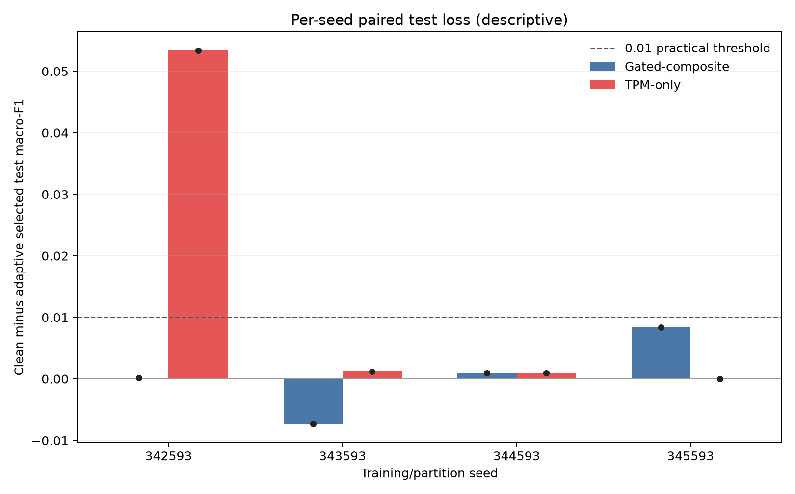
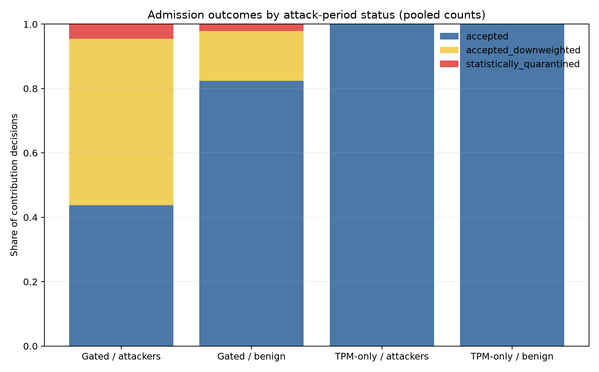
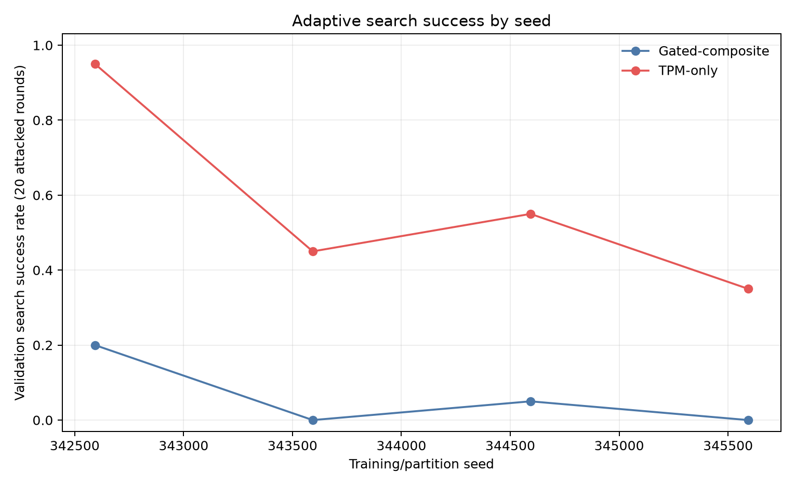

# Untargeted adaptive M6 seed extension

This report combines four verified four-arm campaigns: the seed-342593
continuation and the locked seed replications 343593-345593. It reads preserved
M5 final evaluation and decision artifacts; it does not rerun test inference.
Search and checkpoint selection used validation only.

## Paired selected-checkpoint test loss

Loss is clean minus adaptive test macro-F1; positive values mean the adaptive
arm's selected checkpoint scored lower. These are seed-level observations. Means
and sample standard deviations are descriptive summaries of four training/
partition seeds on UWF-ZeekData24, not a significance test or independent-data
generalization result.

| Seed | Gated loss | TPM-only loss | TPM minus gated |
|---:|---:|---:|---:|
| 342593 | +0.000187 | +0.053343 | +0.053156 |
| 343593 | -0.007300 | +0.001232 | +0.008532 |
| 344593 | +0.000941 | +0.000970 | +0.000029 |
| 345593 | +0.008382 | +0.000000 | -0.008382 |

Mean gated loss: +0.000552 (sample SD 0.006409); mean TPM-only loss: +0.013886 (sample SD 0.026310). Mean TPM-minus-gated difference: +0.013334 (sample SD 0.027431).

## Interpretation limits

The 342593 result is an exploratory first observation; these additional
replications were planned after that outcome was known. All campaigns reuse the
same underlying dataset and existing IID partition pipeline. Seeds are the
replication unit; rounds, queries, and contribution decisions are not independent
samples. Do not describe these four seeds as a confirmatory study or claim
statistical significance.

The TPM-only adaptive checkpoint at seed 342593 was selected at round 10, before
the attack began in round 11. Its lower test score is not evidence that the
selected model contains a poisoned update. Read the per-seed selected rounds,
validation histories, admission denominators, and individual losses before drawing
a conclusion. The adaptive search met the predeclared validation criterion in
4/20 gated and 19/20 TPM-only attack rounds for seed 342593; replication outcomes
are shown separately above and in search-success.csv.

Admission percentages pool contribution decisions for visualization only. The
complete per-seed denominators and action counts are in admission-summary.csv.

See per-arm.csv, paired-losses.csv, rounds.csv, admission-summary.csv,
search-success.csv, and summary.json. Source completion and execution-lock hashes
are recorded in summary.json.
