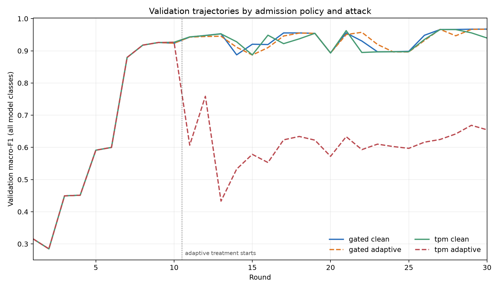
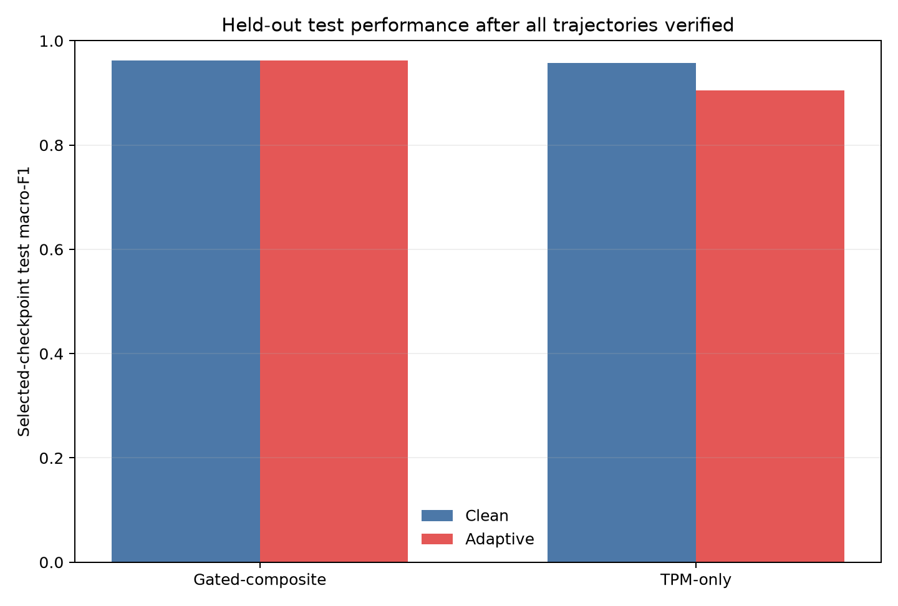
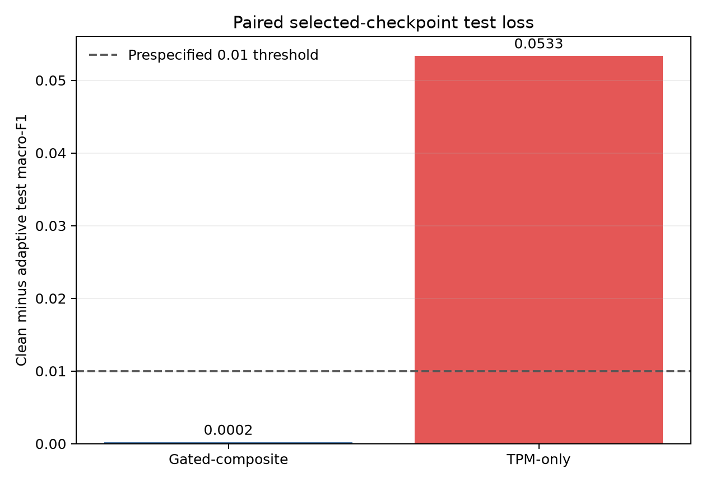

# Untargeted adaptive live M6 results

The report reads only the completed, independently verified four-arm campaign.
The test set was evaluated by the fixed M5 finalizer after every arm completed its
30 rounds. The validation-driven attack never read test.

| Policy | Clean selected test macro-F1 | Adaptive selected test macro-F1 | Paired loss (clean - adaptive) |
|---|---:|---:|---:|
| Gated-composite | 0.9625 | 0.9623 | +0.0002 |
| TPM-only | 0.9576 | 0.9043 | +0.0533 |

The prespecified difference in paired losses (TPM-only minus gated-composite) is
+0.0532. A positive value means the observed loss was larger under
TPM-only. The practical threshold was 0.01 absolute macro-F1. This is a single
seed, so these numbers are descriptive and do not establish statistical significance
or general robustness.

The adversary optimized all-class validation cross-entropy and selected proposals
by validation macro-F1. Results can therefore reflect optimization-set adaptation;
they must be interpreted against the untouched test endpoint and the limited
66-query/round budget. The full evidence preserves selected rounds, per-round
validation curves, candidate decisions and contribution admission outcomes.

See `summary.json`, `cells.csv`, `rounds.csv` and `admissions.csv`. Campaign
completion SHA-256: `4ebb121a388162f086a14108c7626842c8e25dc1a1f777a8b8558e6f85f85023`.

## Interpretation of the adaptive rounds

The attack is active in rounds 11–30. The frozen search-success rule requires a feasible selected proposal to lower all-class validation macro-F1 by at least 0.01 against that round's clean control. This flag was true in 19/20 TPM-only adaptive rounds and 4/20 gated-composite adaptive rounds. Mean validation macro-F1 over rounds 11–30 was 0.6078 for TPM-only and 0.9344 for gated-composite. Across the clean and adaptive arms (900 decisions per policy), gated-composite recorded 714 accepted, 159 downweighted and 27 quarantined contributions; TPM-only accepted all 900.

Checkpoint timing matters when reading the held-out scores: TPM-only adaptive selected round 10, immediately before the attack starts, whereas gated-composite adaptive selected round 30. Therefore the TPM-only test score is from an unpoisoned pre-attack checkpoint. The large clean-minus-adaptive test gap reflects that validation-based selection fell back to this earlier checkpoint after later attacked rounds had poor validation performance; it is not evidence that the selected TPM-only checkpoint contains a successful poisoned update. This distinction and the single-seed scope should be retained in thesis claims.