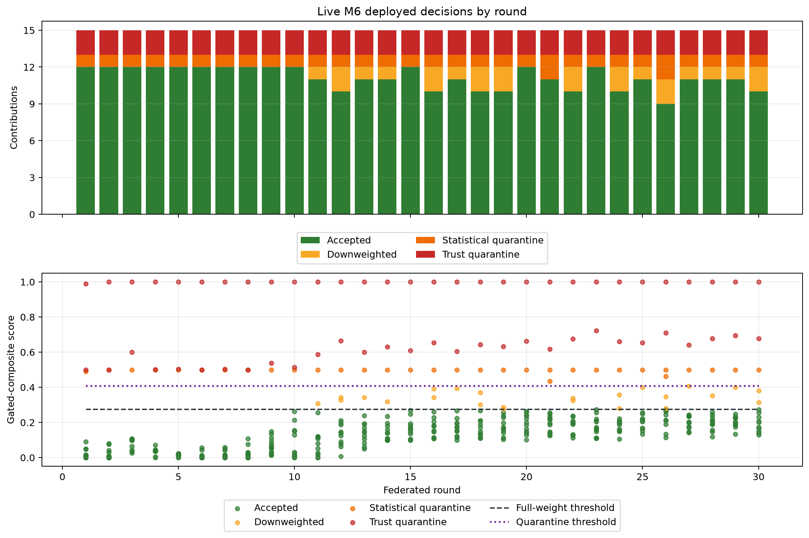
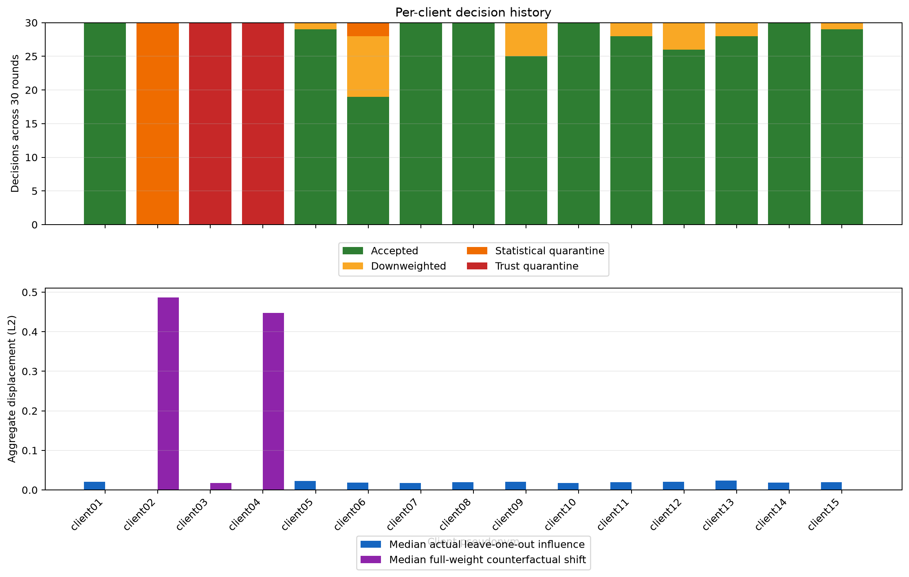

# M6 live contribution-decision explanations — verified local test v1

This sanitized snapshot publishes explanations for all **450 contributions** that drove the
30-round live trust/statistical-disagreement campaign `campaign-cdf764235033c2ea022c9a75`. It explains
the training decision itself—acceptance, downweighting, or quarantine—and is distinct from M7
Integrated Gradients, which explains a model prediction for one log window.

## Main result

The deployed `gated_composite` policy produced:

| Treatment | Count | Share |
|---|---:|---:|
| Full-weight accepted | 334 | 74.22% |
| Accepted with reduced weight | 24 | 5.33% |
| Statistical quarantine | 32 | 7.11% |
| Hard trust quarantine | 60 | 13.33% |

Thus 358/450 updates contributed to FedAvg. Across all rounds, the
effective example weight retained 76.89%
of the nominal submitted weight. All 60 trust-inadmissible
decisions require trust remediation: the explanation deliberately provides no fictitious
statistical-score reduction that could bypass the TPM prerequisite.

## What one explanation contains

Each row binds the signed decision, Update Bundle, and update digests, then reports:

1. the effective M5 trust checks and all four policy outcomes over the same signals;
2. exact statistical/composite scores and signed distance from full-weight and quarantine
   thresholds;
3. ranked scalar indicators and the three named tensors contributing most to distance from the
   round median;
4. nominal and effective FedAvg weight, leave-one-out influence, and the aggregate shift that
   restoring full weight would produce;
5. prior interventions for that client and an explicit counterfactual boundary.

The four deterministic examples in `case-studies.md` make these fields readable without hiding
the complete 450-row table. In particular, the trust/statistics-disagreement case has a normal
statistical score but zero deployed weight because the hard trust gate fails.

## Independent verification

The publication was generated only after the source verifier returned `verified`
with `error_count=0`. It independently reverified the source
campaign and every M6 disagreement round, then recomputed decision mechanics, named tensor
drivers, actual aggregation treatments, and implementation bindings. The content-addressed
source bundle is `m6-live-contribution-explanations-c39cd61a6d17a40691a6928d` with manifest SHA-256
`9d4b30ac3edeafbf1c9a8be7053e280fe28af19b3d44a3d640bfc9fb9e641a6a`.

## Files

- `summary.json`: compact source bindings, coverage, policy totals, risk, influence, and tensor
  summaries.
- `verification-receipt.json`: successful independent-verification result used before
  publication, with the host-specific workspace path reduced to its portable directory name.
- `decisions.csv`: all 450 deployed decisions with provenance, scores, margins, weights,
  influence, and counterfactual quantities.
- `policy-outcomes.csv`: paired totals for TPM-only, statistics-only, sequential, and deployed
  gated-composite policies.
- `rounds.csv`: decision/risk summary for each of the 30 rounds.
- `clients.csv`: 30-round decision/risk summary for each client pseudonym.
- `tensor-drivers.csv`: the three leading named tensor deviations for every contribution.
- `case-studies.md`: four deterministically selected, human-readable mechanism explanations.
- `decision-trajectories.png`: deployed outcomes and composite scores against both thresholds.
- `client-treatment-and-influence.png`: per-client treatment history and aggregate displacement.
- `manifest.json`: SHA-256 inventory of every published file.

## Scope and limitations

These explanations reconstruct why the configured mechanism acted as it did; they do not prove
malicious intent. Test rows and attack labels never enter explanation generation. The 60 hard
trust failures in this particular source campaign remain declared contract-bound
counterfactuals over otherwise passing observed `swtpm` evidence; the separate real-attestation
campaign is the evidence for an authentic PCR/Quote failure. Models, update tensors, signed
bundles, TPM state, and private keys remain only in ignored `artifacts/` workspaces.
