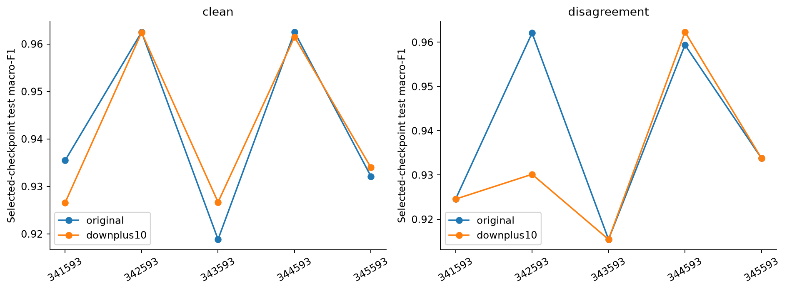
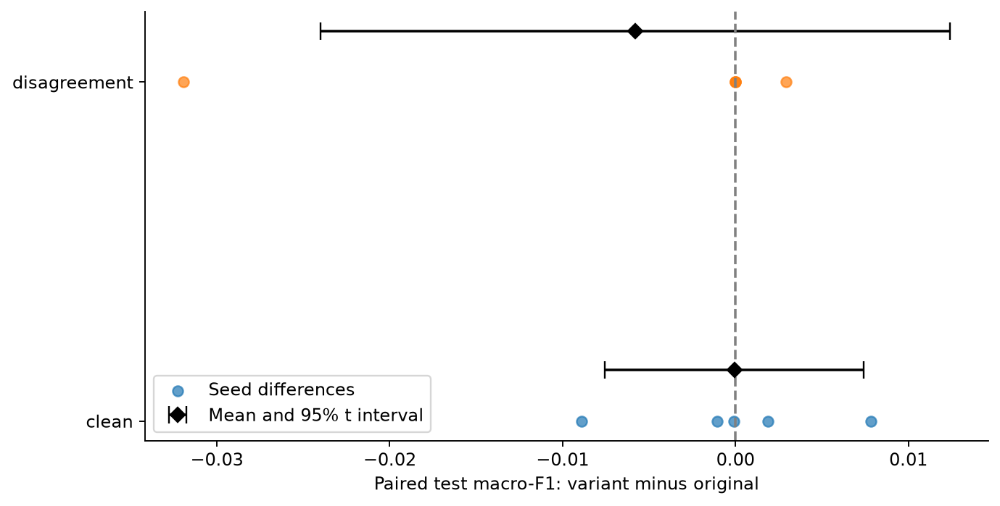
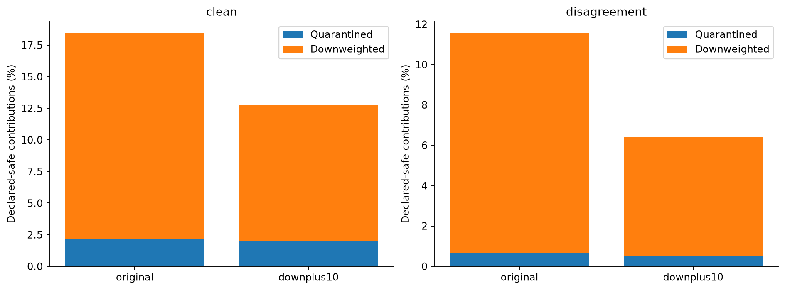
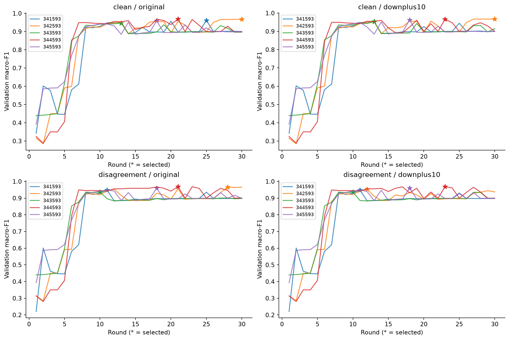

# Exploratory live sensitivity: downweight threshold +10%

Completed 2026-09-26. Ten new 30-round campaigns were paired with ten preserved
original gated campaigns across seeds 341593, 342593, 343593, 344593, 345593.
All campaign verifiers passed, including the additional verification recovered after
Docker Hub timeouts. The report checks source/evaluation/checkpoint/decision hashes,
policy configuration bindings, seeds and common partitions. It relies on the earlier
M5 verification for cryptographic verification and does not replace that verifier.

## Fixed protocol

Only the downweight threshold changes: 0.2748970485340289 to 0.3023867533874318.
Quarantine, factor 0.5, trust veto, CPU training, partitions, 30 rounds, four workers,
refresh interval three and attack assignments remain fixed. The same five seeds
are paired. Both conditions use independent live trajectories, not replayed updates.
Checkpoint selection uses validation. The standard finalizer evaluates selected test
metrics. Because the variant was motivated by earlier replay after test inspection,
these results are exploratory, not independent confirmation or a new parameter search.

## Predictive performance

| Condition | Original test mean ± SD | Variant test mean ± SD | Variant minus original | Paired 95% t interval |
|---|---:|---:|---:|---:|
| Clean | 0.942285 ± 0.019478 | 0.942222 ± 0.018249 | -0.000063 | [-0.007544, +0.007417] |
| Disagreement | 0.939053 ± 0.020853 | 0.933250 ± 0.017658 | -0.005802 | [-0.024011, +0.012407] |

Mean selected validation macro-F1 is 0.960838 versus 0.960622 clean, and 0.955549
versus 0.953153 under disagreement. The clean test means are almost identical;
this is not proof of equivalence. The attacked average falls by 0.580 percentage
points, driven primarily by seed 342593 (-0.031937). Three attacked pairs tie on
test macro-F1 and one improves (+0.002927). Neither interval excludes zero.

Each point is a validation-selected model on the same test split. Lines only connect
seed results for readability; seed is not a continuous explanatory variable.

Positive values favor the variant. Diamonds and bars give mean and approximate
95% Student-t intervals with four degrees of freedom, over five paired differences.
The seed, not round or contribution, is the repetition unit. These descriptive
unadjusted intervals cover this fixed dataset/protocol and do not quantify external
population generalization. Five pairs provide limited resolution.

## Benign intervention and unsafe exclusion

| Condition | Policy | Safe denominator | Safe quarantines | Safe downweights | Unsafe excluded |
|---|---|---:|---:|---:|---:|
| Clean | Original | 2250 | 49 | 366 | N/A |
| Clean | +10% | 2250 | 46 | 242 | N/A |
| Disagreement | Original | 1800 | 12 | 196 | 450/450 |
| Disagreement | +10% | 1800 | 9 | 106 | 450/450 |

The variant reduces clean downweights by 124 (33.9%) and attacked safe downweights
by 90 (45.9%). Combined benign interventions fall from 415/2250 (18.44%) to
288/2250 (12.80%) clean, and from 208/1800 (11.56%) to 115/1800 (6.39%) attacked.
Quarantine counts also change despite an unchanged quarantine threshold because
live model trajectories and later updates change. This differs from frozen replay,
where changing only the downweight threshold left quarantine counts unchanged.

Downweighting is retention at half nominal weight, not full exclusion. Pooled counts
are descriptive repeated client/round observations, not independent detection trials.
All declared-unsafe contributions are excluded in both arms of this specific scenario.
The trust-failure cells are controlled counterfactual inputs, not genuine failed Quotes;
this does not establish robustness to adaptive attacks.

Stars show validation-selected rounds. The curves make clear that reducing benign
interventions does not guarantee improved predictive performance. Inspect runs.csv
for exact selected rounds and rounds.csv for all 600 validation observations.

## Conclusion and next gate

Retain original gated_composite as the reference; the variant is not promoted.
The observed benefit is fewer benign interventions, with no demonstrated predictive
advantage and a lower attacked mean. This is a documented tradeoff, not a failed
experiment to discard. Do not change thresholds further to optimize these test scores.
An independently specified adaptive attack is the next proposed gate. New M7/M8
closures are still needed to preserve these additional research campaigns.

## Files and reproduction

summary.json binds source manifests/evaluations and gives exact statistics. runs.csv
contains all 20 paired source rows; rounds.csv contains 600 validation rows. Four
visually reviewed charts are supplied in PNG/PDF. report-manifest.json inventories
file hashes and the generator hash. Raw logs and private TPM state remain local.

`python scripts/report_m6_live_downplus10.py` regenerates numeric tables and figures
from local verified campaigns and verification logs, refusing an existing output
folder. Preserve this report and choose a new output location for future regeneration.
Markdown interpretation is reviewed separately. Source locks remain unchanged.
