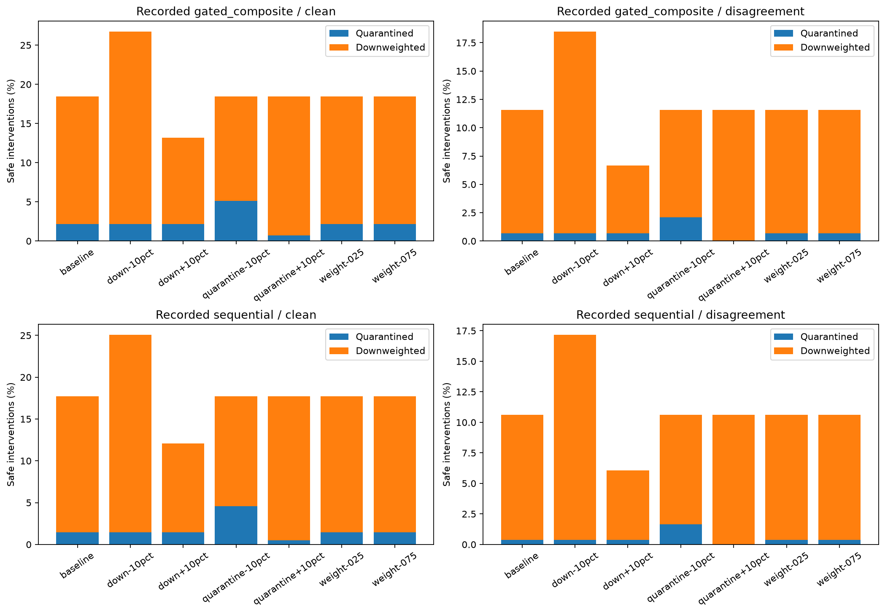
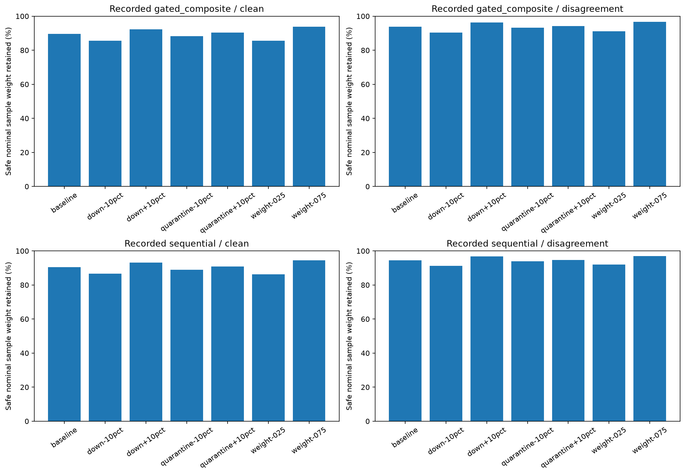

# M6 fixed-signal sensitivity replay

Completed 2026-09-25. Seven predeclared variants were evaluated on all five seeds,
separately on recorded gated and sequential trajectories, in clean/disagreement
conditions. The production decision function reproduced 9,000 deployed decisions
and their effective weights before evaluating 63,000 counterfactual decisions.
A second run recomputed the summary exactly. No training, test evaluation or
parameter selection was performed. The current deployed configuration is unchanged.

## Scope and design

The experiment contract is configs/m6-policy-sensitivity-replay-v1.json. Relative
changes of -10% and +10% are applied to one threshold at a time. Downweight factors
0.25 and 0.75 are compared with 0.50. Risk weights, trust veto, indicator references,
statistical scores and update bytes stay fixed. The baseline thresholds are taken
from each digest-bound source contract, not fitted again. Every candidate is a
gated_composite policy, including when the source trajectory is sequential.
Thus baseline on a sequential trajectory is hypothetical gated admission; it is
not the deployed sequential decision count. Source trajectories are not pooled.

Quarantine and downweight are different interventions. A higher threshold is more
permissive. Threshold changes are relative percentages, not percentage-point shifts.
The factor changes effective weight only; with fixed signals it cannot change the
accept/downweight/quarantine label. A replay can neither estimate new macro-F1 nor
reconstruct the updates that clients would train after an altered aggregation.

## Main findings on recorded gated trajectories

- Clean downweights decrease from 366 to 248 with downweight threshold +10%; safe
  quarantines remain 49. Under disagreement downweights decrease from 196 to 108,
  quarantines remain 12 and all 450 unsafe observations remain excluded.
- Quarantine threshold +10% reduces clean safe quarantines from 49 to 16 and attacked
  safe quarantines from 12 to one. However, three of the 450 unsafe observations
  are now retained at half weight. It does not preserve the observed full exclusion.
- Quarantine threshold -10% increases clean safe quarantines to 115 and attacked
  safe quarantines to 38, with no additional unsafe exclusions in this scenario.
- Factor 0.75 retains more benign nominal weight, but the decision counts are
  unchanged by construction. It supplies no evidence of improved model accuracy.

The same qualitative pattern appears on recorded sequential trajectories: the higher
quarantine threshold again admits three unsafe observations at reduced weight.
This is a check across two source trajectories on the same dataset/seeds, not ten
independent seeds or external validation.

## Complete pooled counts

Counts below pool five seeds descriptively. Each clean row has 2,250 safe observations;
each disagreement row has 1,800 safe and 450 unsafe. The unit for any future uncertainty
estimate is the seed, not the 450 within-campaign client/round decisions.

| Source | Condition | Variant | Safe quarantine | Safe downweight | Unsafe retained | Safe weight retained (%) |
|---|---|---|---:|---:|---:|---:|
| gated_composite | clean | baseline | 49 | 366 | N/A | 89.690 |
| gated_composite | clean | down-10pct | 49 | 553 | N/A | 85.534 |
| gated_composite | clean | down+10pct | 49 | 248 | N/A | 92.312 |
| gated_composite | clean | quarantine-10pct | 115 | 300 | N/A | 88.223 |
| gated_composite | clean | quarantine+10pct | 16 | 399 | N/A | 90.423 |
| gated_composite | clean | weight-025 | 49 | 366 | N/A | 85.624 |
| gated_composite | clean | weight-075 | 49 | 366 | N/A | 93.756 |
| gated_composite | disagreement | baseline | 12 | 196 | 0 | 93.889 |
| gated_composite | disagreement | down-10pct | 12 | 321 | 0 | 90.418 |
| gated_composite | disagreement | down+10pct | 12 | 108 | 0 | 96.334 |
| gated_composite | disagreement | quarantine-10pct | 38 | 170 | 0 | 93.167 |
| gated_composite | disagreement | quarantine+10pct | 1 | 207 | 3 | 94.195 |
| gated_composite | disagreement | weight-025 | 12 | 196 | 0 | 91.168 |
| gated_composite | disagreement | weight-075 | 12 | 196 | 0 | 96.611 |
| sequential | clean | baseline | 33 | 366 | N/A | 90.401 |
| sequential | clean | down-10pct | 33 | 531 | N/A | 86.734 |
| sequential | clean | down+10pct | 33 | 239 | N/A | 93.223 |
| sequential | clean | quarantine-10pct | 103 | 296 | N/A | 88.846 |
| sequential | clean | quarantine+10pct | 11 | 388 | N/A | 90.890 |
| sequential | clean | weight-025 | 33 | 366 | N/A | 86.335 |
| sequential | clean | weight-075 | 33 | 366 | N/A | 94.467 |
| sequential | disagreement | baseline | 7 | 184 | 0 | 94.501 |
| sequential | disagreement | down-10pct | 7 | 302 | 0 | 91.223 |
| sequential | disagreement | down+10pct | 7 | 102 | 0 | 96.778 |
| sequential | disagreement | quarantine-10pct | 30 | 161 | 0 | 93.862 |
| sequential | disagreement | quarantine+10pct | 0 | 191 | 3 | 94.695 |
| sequential | disagreement | weight-025 | 7 | 184 | 0 | 91.945 |
| sequential | disagreement | weight-075 | 7 | 184 | 0 | 97.056 |



Blue is exclusion; orange is retention with reduced weight. The bottom panels apply
gated variants to the recorded sequential trajectory, not variants of sequential.
Changing only the factor leaves these bars identical to baseline.



Weight retention is sum(num_examples × assigned factor) / sum(num_examples) over
safe contributions. It is a descriptive share of nominal training-sample weight,
not normalized aggregate influence, utility, accuracy or unique data coverage:
the same local samples recur across rounds. Round-specific model geometry is held fixed.

## Interpretation and next gate

The replay exposes sensitivity of benign intervention rates and a safety tradeoff
when relaxing quarantine. Downweight-threshold +10% is a candidate for a separately
preregistered live experiment, not a chosen replacement or demonstrated improvement.
No new threshold is installed. An adaptive attack may exploit margins that this
fixed, nonadaptive sign-flip/amplification scenario does not cover. Controlled
trust failures remain counterfactual and the hard trust veto is unchanged.

The original final test was already inspected in the preceding study. These replay
outcomes do not restore an untouched test set. Future live parameter choices should
use development/validation and be labelled exploratory unless confirmed independently.

## Reproduction and verification

Run `python scripts/replay_m6_policy_sensitivity.py` with the source campaigns present;
the generator refuses an existing output directory. To verify an existing report:

```bash
python scripts/replay_m6_policy_sensitivity.py --verify
```

summary.json binds configuration, generator and source manifest digests. The replay
checks checkpoint hashes against manifests, admission-contract hashes and decision
hashes against checkpoints, and reconstructs original policy decisions and weights.
It relies on the already completed M5 campaign verification for cryptographic trust
and numerical statistical-score provenance; it does not recompute scores from raw
updates or independently reverify signatures. It fails on unscored or integrity-failed
contributions rather than silently bypassing them. No test files are opened.

per-seed.csv provides 140 seed/source/condition/variant rows; aggregate.csv provides
28 descriptive pooled rows. Both figures are available in PNG and PDF. The report
inventory binds file hashes. Figures were visually reviewed. No raw logs or private
TPM artifacts are included; no commit or push was performed.
