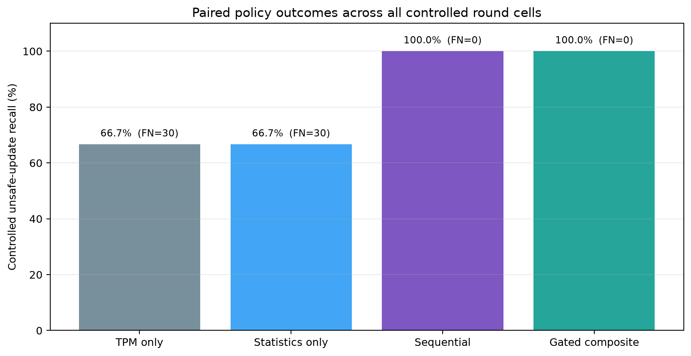
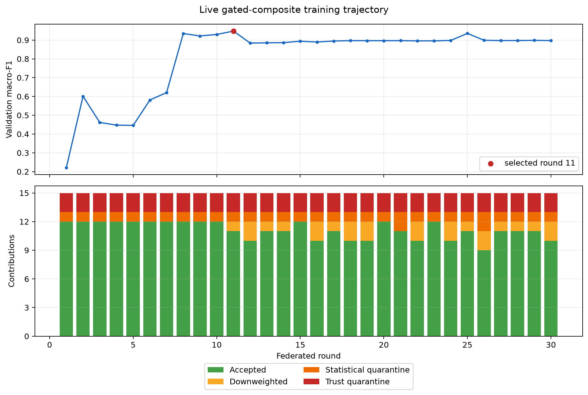
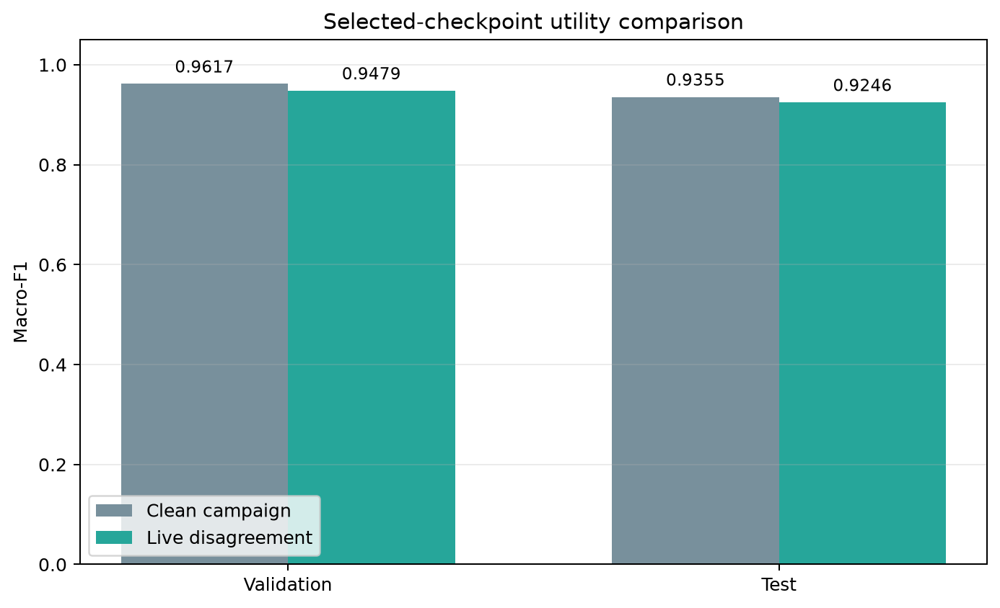
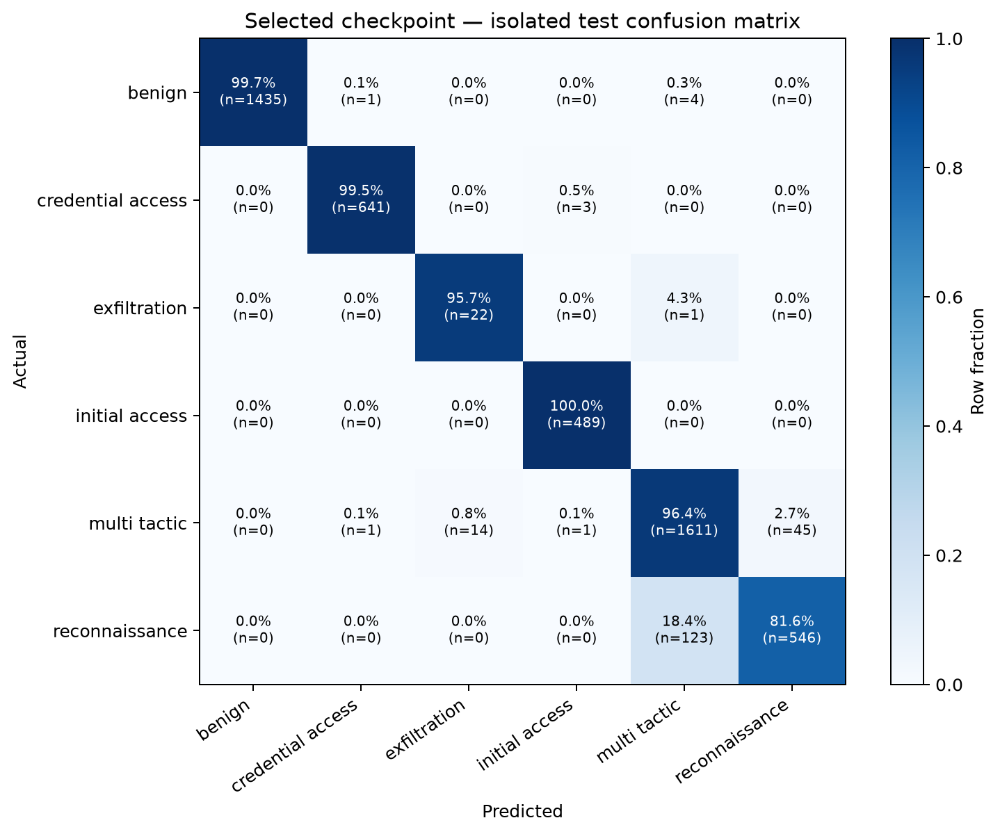

# M6 live TPM/statistical disagreement — verified local test v1

This sanitized snapshot summarizes the independently verified 30-round campaign
`campaign-cdf764235033c2ea022c9a75`. Every round trained 15 local clients, obtained a TPM-backed
signature over each submitted update, evaluated the trust and statistical signals on that
same contribution, and used the `gated_composite` decision in the actual FedAvg aggregate.

## Main result

Across 30 rounds, the controlled matrix produced 90 unsafe and 30
safe observations; the other 330 safe observations came from the background clients. The
combined policies quarantined all 90 controlled unsafe contributions. TPM-only
missed the correctly attested
statistical anomaly, while statistics-only missed the trust-failed but statistically normal
contribution. This is the intended empirical signal disagreement.

| Policy | TP | FN | TN | FP | Unsafe recall |
|---|---:|---:|---:|---:|---:|
| TPM only | 60 | 30 | 30 | 0 | 66.7% |
| Statistics only | 60 | 30 | 30 | 0 | 66.7% |
| Sequential | 90 | 0 | 30 | 0 | 100.0% |
| Gated composite | 90 | 0 | 30 | 0 | 100.0% |

The deployed composite policy aggregated 358 of
450 contributions: 334
at full weight and 24 at reduced
weight. It quarantined 92 contributions. Ninety quarantines
were the three controlled unsafe cells repeated over 30 rounds; the other two were safe
`client06` updates at rounds 21 and 26. Thus strict false-positive quarantine was
0.56% over safe contributions. A further
24 safe contributions were retained at reduced weight.

## Selected model utility

Validation-only selection chose round 11 with macro-F1
`0.947864`. The isolated test macro-F1 is `0.924554` and accuracy
is `0.960907`. Across the 15 client-local test splits, macro-F1 is
`0.932066 ± 0.035769`
(population standard deviation).

Against the separate clean in-round campaign, test macro-F1 changes by
`-0.010913` and validation macro-F1 by
`-0.013855`. This is a descriptive comparison of
two deterministic campaign trajectories, not a confidence interval. The performance cost is
consistent with removing three client contributions in every round; the transformed unsafe
updates themselves never enter the deployed composite aggregate.

## Files

- `summary.json`: compact source bindings, policy totals, false-positive rates, and utility.
- `policy-outcomes.csv`: aggregate status and controlled confusion counts for all four policies.
- `rounds.csv`: validation trajectory and deployed-policy treatment counts by round.
- `safe-interventions.csv`: the 24 safe downweights and two safe quarantines.
- `selected-test-per-class.csv`: isolated test precision, recall, F1, and support by class.
- `manifest.json`: SHA-256 inventory of every published file.

## Scope and limitations

All 450 per-contribution observed M4 appraisal checks passed. The
60 trust-failure inputs are declared contract-bound counterfactuals used to compare policy
behavior; they are not physical TPM failures. The 60 anomalous updates are genuine
post-training sign-flip and amplification transformations signed by the client TPM ESK.

Only `gated_composite` drives this training trajectory. TPM-only, statistics-only, and
sequential are paired shadow decisions over the same updates, so this snapshot compares their
admission accuracy but does not claim four separately trained model trajectories. Attack labels
are used only after scoring. The temporal holdout is benign-only and is not a multiclass test.
Complete models, signed bundles, update vectors, private keys, and TPM state remain in ignored
`artifacts/` workspaces and are not published here.
