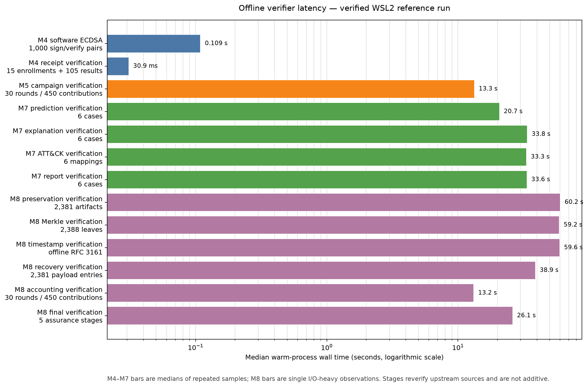

# Verified M4–M8 offline-overhead result

This sanitized snapshot publishes the verified timing summary for the preserved local-test
reference chain. All 13 configured stages returned `verified`; the receipt verifier
recomputed 13 source snapshots and all statistics with zero errors.

The run used CPython 3.14.4 under WSL2 Linux on x86-64 with six logical CPUs. It recorded 45
measured samples and seven retained warmups. The measured samples total 773.227 seconds, but
that value is experiment work across repeated stages—not the latency of one request or one
runtime workflow.

## Main measurements

| Stage | Wall-time result |
|---|---:|
| Software ECDSA P-256, 1,000 sign/verify pairs | median `108.964 ms`; mean `114.016 µs` per pair |
| M4, 15 enrollments and 105 signed appraisal receipts | median `30.936 ms` |
| M5, complete 30-round/450-contribution campaign | median `13.342 s` |
| M7 prediction verification, six cases | median `20.716 s` |
| M7 explanation verification, six cases | median `33.773 s` |
| M7 ATT&CK verification, six mappings | median `33.298 s` |
| M7 report verification, six cases | median `33.556 s` |
| M8 preservation inventory, 2,381 artifacts | one observation: `60.228 s` |
| M8 Merkle commitment, 2,388 leaves | one observation: `59.241 s` |
| M8 RFC 3161 timestamp, offline | one observation: `59.583 s` |
| M8 recovery package, 2,381 payload entries | one observation: `38.907 s` |
| M8 campaign accounting, 30 rounds/450 contributions | one observation: `13.204 s` |
| M8 final preservation, five assurance stages | one observation: `26.110 s` |

## Correct interpretation

These are warm-process offline-verification measurements. Python startup is excluded. M7
explanation, ATT&CK, and report verification recursively recheck their upstream bundles;
similarly, M8 Merkle and timestamp verification revalidate preservation sources. The rows are
therefore end-to-end verifier costs with overlapping work and must not be added to estimate a
pipeline request.

M8 stages have one observation each because they are I/O-heavy and repeatedly traverse
multi-gigabyte inputs. They do not support a variance or percentile claim. Sequential
execution, page-cache state, WSL2 virtualization, host load, storage, and native-library
threading all influence the observed values.

The ECDSA row uses an ephemeral in-memory software key. It is not `swtpm` or physical-TPM
latency. The M4 receipt row validates already preserved signed appraisal results; it does not
perform a live challenge, Quote, PCR exchange, mTLS handshake, or network request. M5 measures
campaign verification, not training or online aggregation.

## Receipt and files

- benchmark: `m4-m8-offline-overhead-local-test-v1`;
- receipt: `overhead-benchmark-242c9f91b96d5b8fad17acff`;
- source benchmark manifest SHA-256:
  `da7c63073810f3f4295f52f4acd3e55d6a4916b8d0facd0b24cd8ceb7cbd75e9`;
- source summary SHA-256:
  `3466b926adc7464451dda343045a2b5de69898c8e8bda5d3a7e7c29ea992fd63`;
- source sample SHA-256:
  `38af0d7aeea9150ab2e7ff34173f3a767bff9d23a1f8900ee3f67d4630fee1a8`.

`summary.json` is copied byte-for-byte from the verified workspace. `stages.csv` is a compact
derived table, `median-wall-time.png` visualizes the same medians on a logarithmic scale, and
`receipt.json` records the verification outcome and source hashes. `manifest.json` binds all
five published files.

Raw timing samples, the 38 KB source manifest with per-artifact paths, datasets, models,
client updates, certificates, TPM state, private keys, and the 2.6 GB recovery TAR remain
outside Git.
