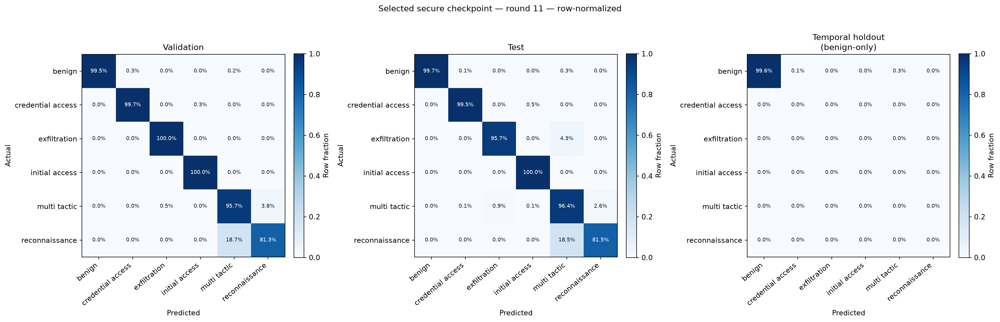
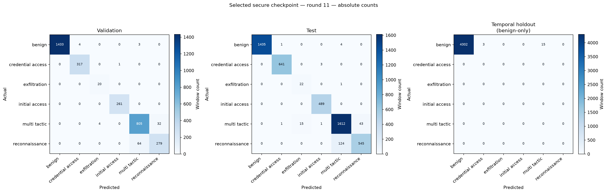

# Reference local-test v1 results

This is the public, sanitized view of the completed local-test reference chain. It lets a
reader inspect the main numerical results, confusion matrices, learning curves, investigation
report, and final preservation receipt without access to the private evidence vault.

## Headline results

| Item | Verified result |
|---|---:|
| Selected secure checkpoint | round 11 of 30 |
| Accepted client contributions | 450 of 450 |
| Validation macro-F1 | 0.948333 |
| Pooled test macro-F1 | 0.922567 |
| Pooled test accuracy | 0.960907 |
| Per-client selected-global test macro-F1 | mean 0.928443; population std. dev. 0.035334; minimum 0.876348 |
| Client confusion matrices | 15 |
| M7 investigation cases | 6, bound to 69 events and 81 source records |
| M8 preservation | 2,381 payload artifacts; 2,388 Merkle leaves; five assurance stages verified |

These values describe one deterministic run and are not confidence intervals or evidence of
universal generalization. The temporal holdout contains only benign samples, so its 0.995833
accuracy is a narrow false-positive/drift check. It is not a six-class attack-detection score;
the validation and test partitions are the multi-class evaluation sets.

## Confusion matrices

The first figure is row-normalized; the second shows absolute counts. Both include validation,
pooled test, and the explicitly labelled benign-only temporal holdout.

Per-client local-test confusion matrices:

| Clients 1–5 | Clients 6–10 | Clients 11–15 |
|---|---|---|
| [client01](m5/per-client-confusion/client01.png) | [client06](m5/per-client-confusion/client06.png) | [client11](m5/per-client-confusion/client11.png) |
| [client02](m5/per-client-confusion/client02.png) | [client07](m5/per-client-confusion/client07.png) | [client12](m5/per-client-confusion/client12.png) |
| [client03](m5/per-client-confusion/client03.png) | [client08](m5/per-client-confusion/client08.png) | [client13](m5/per-client-confusion/client13.png) |
| [client04](m5/per-client-confusion/client04.png) | [client09](m5/per-client-confusion/client09.png) | [client14](m5/per-client-confusion/client14.png) |
| [client05](m5/per-client-confusion/client05.png) | [client10](m5/per-client-confusion/client10.png) | [client15](m5/per-client-confusion/client15.png) |

## Other learning outputs

- [Validation performance by round](m5/global-validation-by-round.png)
- [Client validation-F1 heatmap](m5/client-validation-f1-heatmap.png)
- [Client update-norm heatmap](m5/client-update-norm-heatmap.png)
- [Local train/validation macro-F1](m5/local-train-validation-macro-f1.png)
- [Local train/validation loss](m5/local-train-validation-loss.png)
- [Selected validation/test per-class F1](m5/selected-validation-test-per-class-f1.png)
- [Round/client/epoch metric table](m5/round-client-epoch-metrics.csv)
- [Complete M5 machine-readable summary](m5/summary.json)
- [M5 report manifest with artifact digests](m5/manifest.json)

## Investigation and preservation

- [Human-readable M7 investigation report](m7/report.md)
- [Machine-readable M7 investigation report](m7/investigation-report.json)
- [M7 report manifest with artifact digests](m7/manifest.json)
- [Final M8 verification receipt](m8/final-verification.json)
- [Compact cross-stage summary](summary.json)

The final M8 verification reconstructed the preservation inventory, Merkle commitment,
trusted timestamp, recovery payload, and 30-round campaign invariants from offline inputs.
Its status was `verified` with zero errors. The complete recovery archive remains outside Git
under the project's evidence-retention policy.

## Disclosure boundary

This snapshot contains only metrics, figures, digests, identifiers, and sanitized reporting.
It excludes source data, raw or normalized events, feature rows, model parameters, client
updates, private keys, TPM state, certificates, and recovery payloads. The 15 TPM instances
used by this run were software TPMs; they validate the integration and appraisal workflow,
not hardware-backed endpoint assurance.
