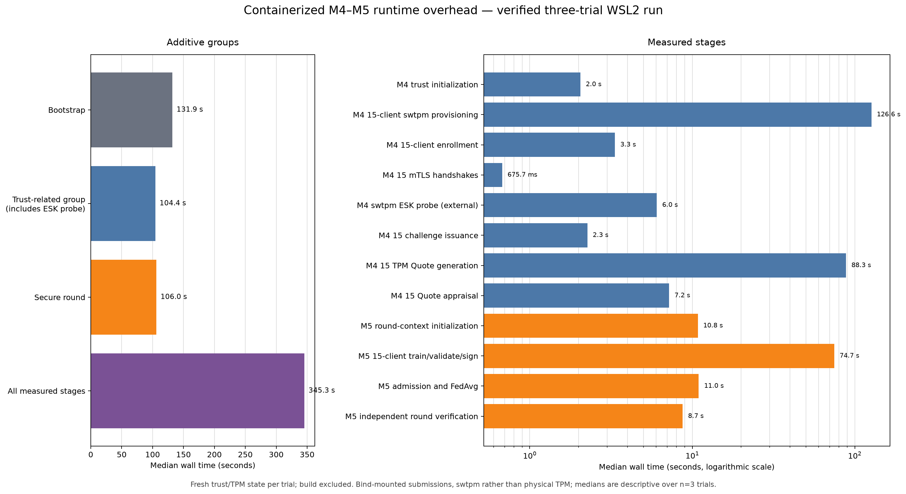

# Verified M4–M5 containerized-runtime overhead

This sanitized snapshot publishes the verified three-trial runtime measurement of the local
M4/M5 prototype. Every trial created fresh trust authorities, 15 independent `swtpm` states,
15 enrollments and TLS identities, 15 one-use Quotes, 15 TPM-signed Update Bundles, and one
independently reproduced FedAvg checkpoint. All 36 configured stage executions passed.

The run used CPython 3.14.4, Docker Engine
29.6.2, and WSL2 Linux on x86-64 with
6 logical CPUs. Docker image construction was excluded from
the timed lifecycle.

## Main measurements

| Scope | Wall-time result |
|---|---:|
| Fresh M4 bootstrap | median `131.897 s` |
| Trust-related group, including diagnostic ESK probe | median `104.403 s` |
| Secure M5 round | median `105.980 s` |
| All measured stages | median `345.315 s` |
| Provision 15 independent swtpm clients | median `126.627 s` |
| Generate 15 TPM Quotes sequentially | median `88.290 s` |
| Train, validate, and TPM-sign 15 clients (4 workers) | median `74.728 s` |
| Admission and FedAvg | median `10.957 s` |
| Independent secure-round verification | median `8.722 s` |
| Direct ESK signature through `tpm2_sign` | median `13.854 ms`; 60 measured signatures |
| 15 real loopback TLS 1.3 mTLS handshakes | median `0.676 s` total |

Provisioning and sequential Quote generation dominate the M4 path. The direct TPM signing
operation is small by comparison: the approximately six-second external probe stage also
contains container startup, Python startup, two warmups, and 20 measured signatures per
trial. The 15-client M5 stage includes local training, validation, model serialization, ESK
signing, container scheduling, and writes to isolated submission directories.

## Correct interpretation

- `swtpm` exercises the TPM protocol and key-role implementation but is not a physical-TPM
  latency or hardware non-exportability result.
- Signed updates move through separate bind-mounted submission directories. No HTTP/gRPC
  contribution API, WAN transfer, broker, queue, or remote object store was measured.
- `trust-gate` includes the diagnostic ESK probe. `measured-total` is total benchmark work,
  not the latency of one ordinary contribution request.
- Stage CPU fields in `summary.json` measure the host orchestrator and Docker CLI processes;
  they do not represent total CPU consumed inside Docker containers.
- With only three independent trials, medians, ranges, and population standard deviations are
  descriptive. They are not confidence intervals or broad hardware-performance claims.
- This one-round overhead experiment performs client train and validation only. It never opens
  pooled test, benign-only temporal holdout, or client-local test artifacts; those remain
  post-selection operations of the verified 30-round reference campaign.

## Receipt and published files

- benchmark: `m4-m5-containerized-runtime-overhead-local-test-v1`;
- receipt: `runtime-overhead-adb5811cce9ded407e4b1e0d`;
- source runtime manifest SHA-256: `2a8c19ee782a429a4ca40a020cd6e74897cbc30d1de241e8624dba9f657cb7e4`;
- source configuration SHA-256: `723a0fe738a5cec3e3157665740d93beb7b9a95b0cbada7ecf95f67f823d25f7`;
- source implementation SHA-256: `42e04ab9715c4b88c7418a0a48461b0ba4af27bb43fd8a79e0c980e71b800711`;
- source samples SHA-256: `ed5cc27fcdcb567cd11b497cb084e700c842c6e4abe0d6b7f44417d09f94a7f8`;
- source summary SHA-256: `e3579c3807ff4a406a2c266e5dcb57acdd3e8edd28b5f2422207a69159731fcf`.

`summary.json` is copied byte-for-byte from the verified receipt workspace. `stages.csv` and
`spans.csv` are compact derived tables, `runtime-wall-time.png` visualizes the medians, and
`receipt.json` records the successful verification and source hashes. `manifest.json` binds
all six published payload files.

Raw samples and command logs, enrollment records, challenges, Quote evidence, certificates,
client updates, model checkpoints, coordinator keys, and Docker TPM state remain under the
Git-ignored `artifacts/` and Docker volumes. They are deliberately not published.
